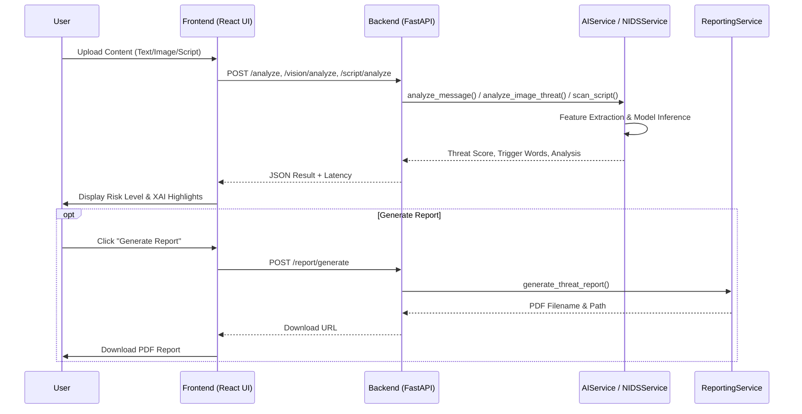

# CyberForge AI System Diagrams

This document provides a visual representation of the CyberForge AI platform's processes and use cases.

## 1. Process Flow Diagram

The following diagram illustrates the typical data flow when a user submits content (text, image, or script) for threat analysis.



## 2. Use-Case Diagram

This diagram shows the main functional requirements of the CyberForge AI platform and how different actors interact with them.

```mermaid
useCaseDiagram
    actor "Student/User" as User
    actor "Cyber Analyst" as Admin
    
    package "CyberForge AI Core" {
        usecase "Analyze Phishing (NLP)" as UC1
        usecase "Network Intrusion Detection (NIDS)" as UC2
        usecase "Deepfake / Vision Audit" as UC3
        usecase "Malicious Script Audit" as UC4
        usecase "Generate PDF Threat Reports" as UC5
        usecase "Monitor Hardware (NPU/ROCm) Stats" as UC6
        usecase "Provide Model Feedback" as UC7
    }

    User --> UC1
    User --> UC2
    User --> UC3
    User --> UC4
    User --> UC5
    User --> UC6
    
    Admin --> UC2
    Admin --> UC5
    Admin --> UC6
    Admin --> UC7
```

> [!NOTE]
> All processes are optimized for AMD Ryzen™ AI NPUs and ROCm-accelerated hardware, ensuring sub-10ms latency for critical detections.
